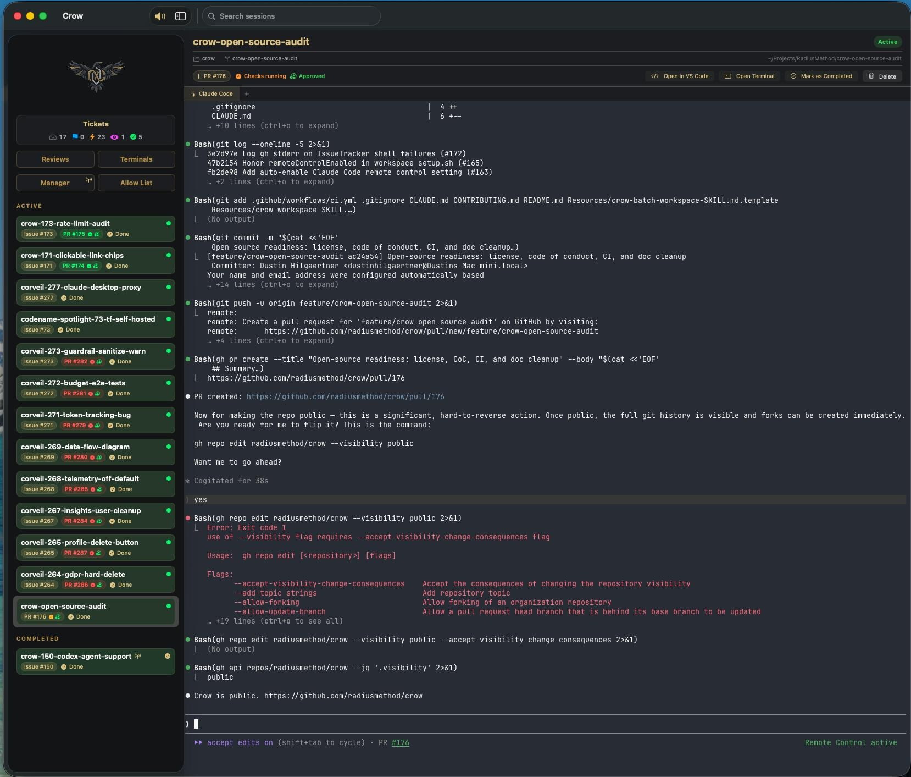

# Crow

A native macOS application for managing AI-powered development sessions. Orchestrates git worktrees, Claude Code instances, and GitHub/GitLab issue tracking in a unified interface with an embedded Ghostty terminal.



## Prerequisites

### System Requirements

- **macOS 14.0+** (Sonoma or later)
- **Apple Silicon** (arm64)
- **Xcode** with Command Line Tools installed

### Build Dependencies

| Tool  | Version | Purpose                                | Install                                                                           |
| ----- | ------- | -------------------------------------- | --------------------------------------------------------------------------------- |
| Swift | 6.0+    | Compiler (ships with Xcode)            | `xcode-select --install`                                                          |
| Zig   | 0.15.2  | Builds the Ghostty terminal framework  | `brew install zig` or [ziglang.org](https://ziglang.org/download/)                |
| mise  | latest  | Task runner (optional)                 | `brew install mise`                                                               |

### Runtime Dependencies

| Tool     | Purpose                                                       | Install                                               |
| -------- | ------------------------------------------------------------- | ----------------------------------------------------- |
| `gh`     | GitHub CLI — issue tracking, PR status, project boards        | `brew install gh`                                     |
| `git`    | Worktree management                                           | Ships with Xcode CLT                                  |
| `claude` | Claude Code — AI coding assistant                             | [claude.ai/download](https://claude.ai/download)      |
| `glab`   | GitLab CLI (optional, for GitLab repos)                       | `brew install glab`                                   |

## Quick Start

```bash
# 1. Clone with submodules
git clone --recurse-submodules https://github.com/radiusmethod/crow.git
cd crow

# 2. Build (submodules + GhosttyKit + swift build in one shot)
make build

# 3. Authenticate GitHub CLI — the write `project` scope is required
gh auth login
gh auth refresh -s project,read:org,repo

# 4. Run
.build/debug/CrowApp
```

On first launch, a setup wizard guides you through choosing your development root directory and configuring workspaces. Alternatively, configure via the CLI without launching the GUI:

```bash
.build/debug/crow setup
```

> **Note:** The required GitHub scope is the **write** `project` scope — `read:project` is insufficient because Crow updates ticket status via the `updateProjectV2ItemFieldValue` GraphQL mutation. See [docs/getting-started.md](docs/getting-started.md#3-github-authentication) for details.

## Documentation

- [**Getting Started**](docs/getting-started.md) — Clone, build, authenticate, and launch
- [**CLI Reference**](docs/cli-reference.md) — Every `crow` subcommand and its flags
- [**Architecture**](docs/architecture.md) — Packages, key components, data flow
- [**Configuration**](docs/configuration.md) — File locations, workspace config, directory layout, session lifecycle
- [**Troubleshooting**](docs/troubleshooting.md) — Build and runtime errors

## Usage

### The Sidebar

- **Tickets** — Assigned issues grouped by project board status (Backlog, Ready, In Progress, In Review, Done in last 24h). Click a status to filter.
- **Manager** — A persistent Claude Code terminal for orchestrating work. Use `/crow-workspace` here to create new sessions.
- **Active Sessions** — One per work context. Shows repo, branch, issue/PR badges with pipeline and review status.
- **Completed Sessions** — Sessions whose PRs have been merged or issues closed.

### Creating a Session

In the Manager tab, tell Claude Code what you want to work on:

```
/crow-workspace https://github.com/org/repo/issues/123
```

Or use natural language:

```
/crow-workspace "add authentication to the acme-api API"
```

This will:

1. Create a git worktree with a feature branch
2. Create a session with ticket metadata
3. Launch Claude Code in plan mode with the issue context
4. Auto-assign the issue and set its project status to "In Progress"

## Features

### Ticket Board

- Pipeline view showing issues by project board status
- Click a status to filter the list
- "Start Working" button creates a workspace directly from an issue
- Issues linked to active sessions show a navigation button

### PR Status Tracking

- Pipeline checks (passing/failing/pending)
- Review status (approved/changes requested/needs review)
- Merge readiness (mergeable/conflicting/merged)
- Purple badge with checkmark for merged PRs

### Auto-Complete

- Sessions automatically move to "Completed" when their linked PR is merged or issue is closed
- Checked every 60 seconds during the issue polling cycle

### Orphan Recovery

- On startup, scans git worktrees across all repos
- Worktrees not tracked in the store are automatically recovered as sessions
- Fetches ticket metadata and PR links from GitHub for recovered sessions

### Safe Deletion

- Deleting a session on a protected branch (main, master, develop) only removes the session metadata — the repo folder and branch are preserved
- The delete confirmation dialog reflects this, showing "Remove Session" instead of "Delete Everything"

## Development

### Adding a New Package

1. Create the package under `Packages/`
2. Add it to the root `Package.swift` dependencies and target
3. Import in the targets that need it

### Testing

```bash
make test     # or: swift test, or: mise test
```

Tests use the [Swift Testing](https://developer.apple.com/documentation/testing/) framework (`@Test` macros). Test files live under `Packages/*/Tests/`.

## Contributing

We welcome contributions! See [CONTRIBUTING.md](CONTRIBUTING.md) for guidelines on reporting bugs, suggesting features, and submitting pull requests.

## Releases

Official releases are signed and notarized via GitHub Actions. Download the latest DMG from the [Releases](https://github.com/radiusmethod/crow/releases) page — it will install without Gatekeeper warnings.

**Building from source:** Code signing is only required for distribution. Developers building from source do not need a signing certificate — `make build` and `make release` produce unsigned but fully functional builds. If macOS quarantines an unsigned `.app`, remove it with:

```bash
xattr -cr Crow.app
```

## License

Apache 2.0 — see [LICENSE](LICENSE) for details.
